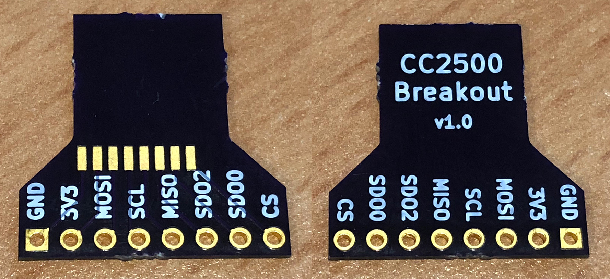
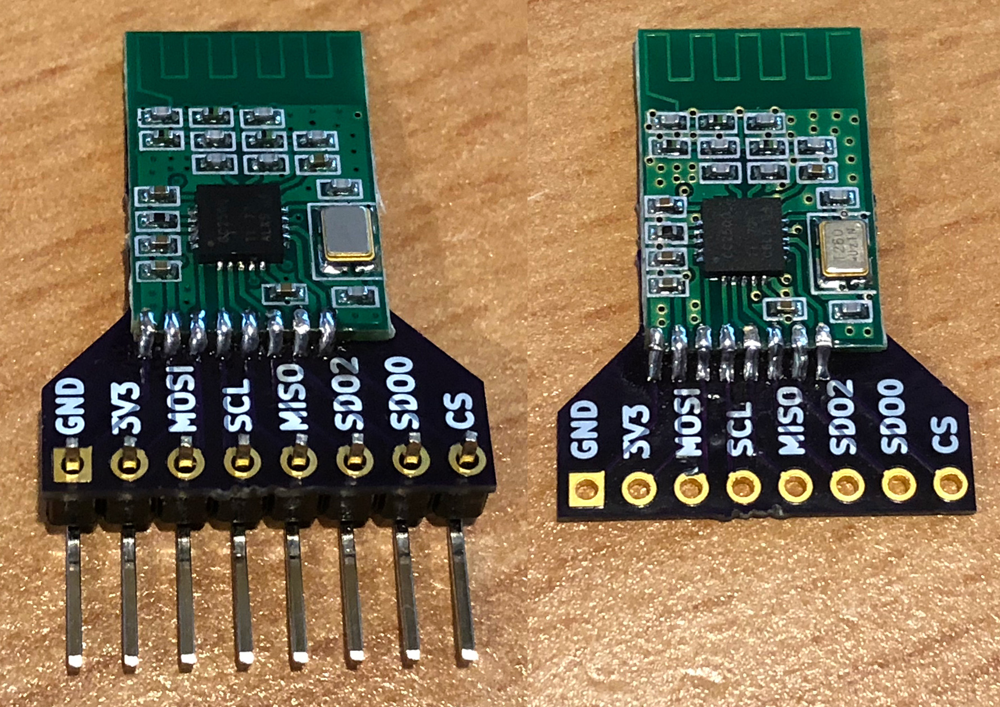
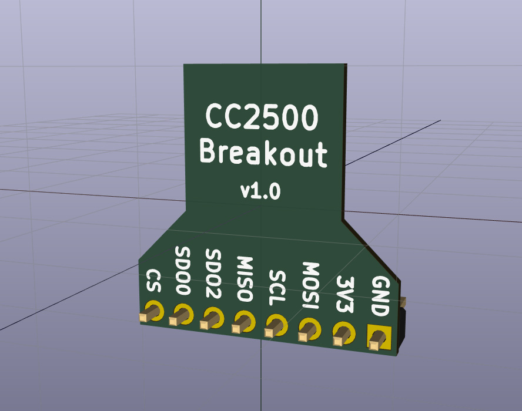
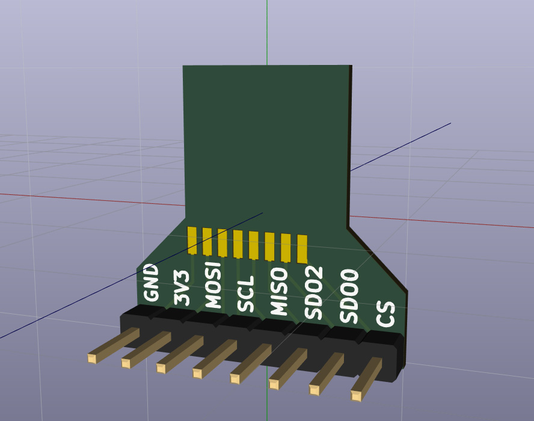
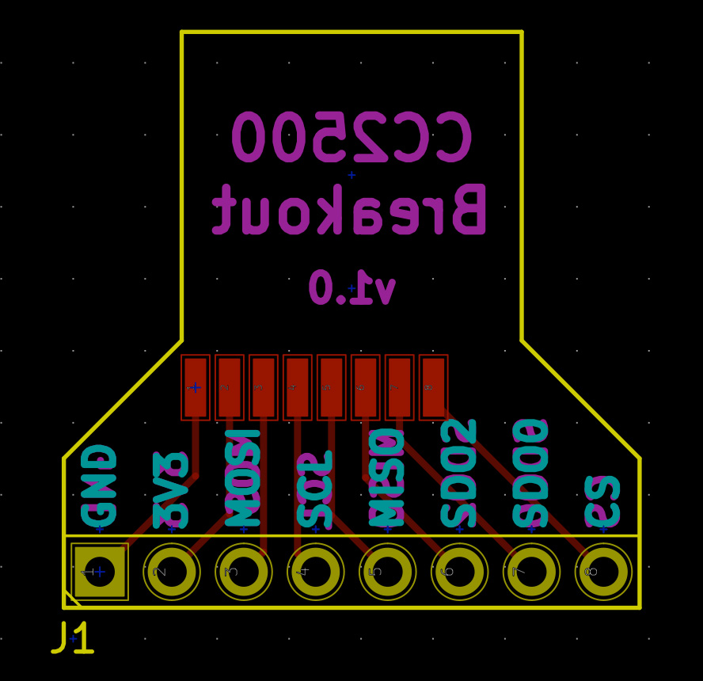
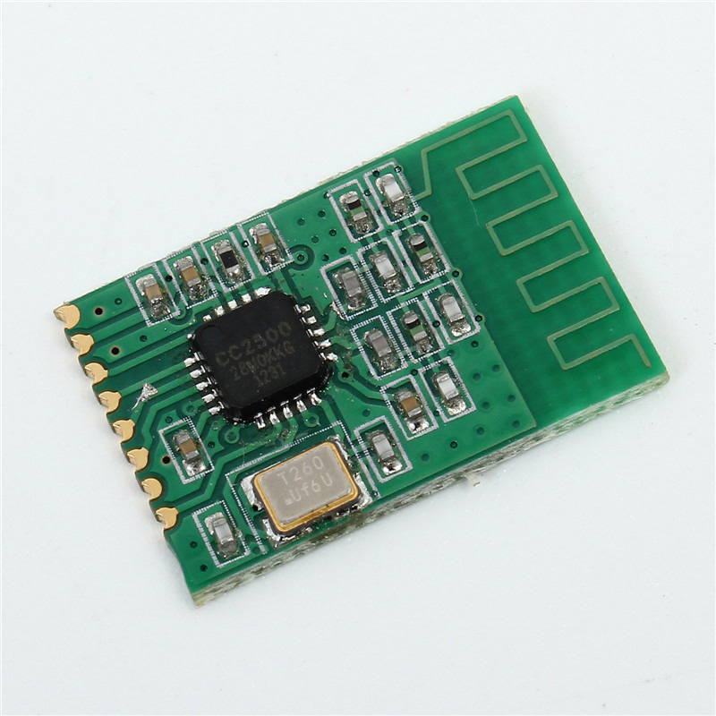
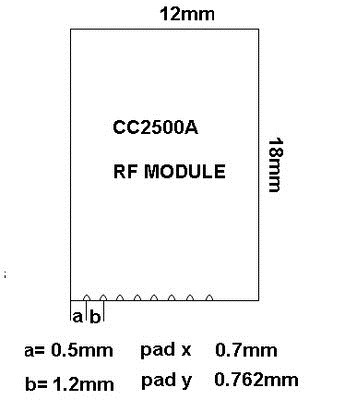

# CC2500 Breakout

Breakout board for the [CC2500 2.4GHz RF transceiver module](https://www.aliexpress.com/item/Wireless-Transceiver-Module-CC2500-2-4G-2400-2483-5-MHz-ISM-SRD-Low-power-Consistency-Stability/32702148262.html).

Order the board from OSH Park here: <https://oshpark.com/shared_projects/chUQvFmW>

3x boards for $3.20 (2 oz copper, 0.8mm thickness)

Only component you need is 1x8 straight or right-angle 2.54mm headers.

Designed using [KiCad](http://kicad-pcb.org/).

# OSH Park Purple PCBs

They look black here, but that's just the dim lighting in my office. They are dark purple PCBs.

# Models

# PCB

# CC2500 module

# Links

* [CC2500 2.4GHz RF transceiver module](https://www.aliexpress.com/item/Wireless-Transceiver-Module-CC2500-2-4G-2400-2483-5-MHz-ISM-SRD-Low-power-Consistency-Stability/32702148262.html)
* [Order the board on OSH Park](https://oshpark.com/shared_projects/chUQvFmW)

# License

Licensed under the [MIT License](http://opensource.org/licenses/MIT).
